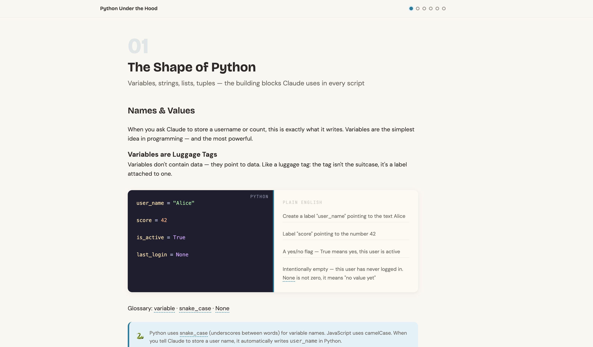

# Project

## Lanuages

[中文](./docs/README.zh-cn.md)

## Description

- This project is a summary of Python syntax based on the book _Python Crash Course (3rd Edition)_, including but not limited to the content covered in the book.

- **Target Audience:** Programmers already proficient in other programming languages.

## [Preview course](https://fishes-pool.github.io/py_learn/py-course/index.html)

## Tech Stack

- Python

## Table of Contents

The `chapter_*` folders represent the "Basic Knowledge" section. Some chapters have been consolidated into single folders for better organization.

- **Outline:**
  - **Chapter 2:** Variables and Simple Data Types
  - **Chapter 3:** Lists (Operations, Iteration, and Tuples)
  - **Chapter 5:** If Statements & Logical Control
  - **Chapter 6:** Dictionaries
  - **Chapter 7:** User Input and While Loops
  - **Chapter 8:** Functions
  - **Chapter 9:** Classes
  - **Chapter 10:** Files and Exceptions
  - **Chapter 11:** Testing Your Code
